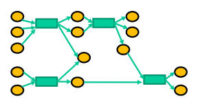

# Graph
To get any graph, import 
<b>getGraph(dd, mm, yy, dOffset,graphType)</b> function from getAPIData. 
 

* To get the <b>COMPOSITE</b> graph object:  
 Suppose you want a COMPOSITE graph for 10 days from date February 9, 2009 then : 
    * Inputs: 
dd = 9   
mm = 2  
yy = 2009   
dOffset = 10  
graphType = COMPOSITE
    * Output:
Two values will be returned: 
 "Success"/"Fail" 
 The composite graph in the form of object of <b>MultiDiGraph</b>
    * Here, edges of the graph will be of 2 types:
        * Address, Transaction hash, Amount
        * Transaction hash, Address, Amount

One can differentiate Transaction hash by its length, which is 64.
   

<h3>Inputs: </h3>
<b>graphType</b> may take one of the three values : 
<ul>
<li>COMPOSITE
<li>ADDRESS
<li>TRANSACTION
</ul>
dirPath = "../XYZ"

<h3>Output:</h3>
<ul>
<li>
In case of <b>COMPOSITE </b> graph you will get an edge list file at the given directory path("../XYZ")
 
<li>
In case of <b>ADDRESS</b> graph you will get an edge list file and a vertex list file at the given directory path("../XYZ")
 
<li>
In case of <b>TRANSACTION</b> graph you will get an edge list file and a vertex list file at the given directory path("../XYZ")
</ul>